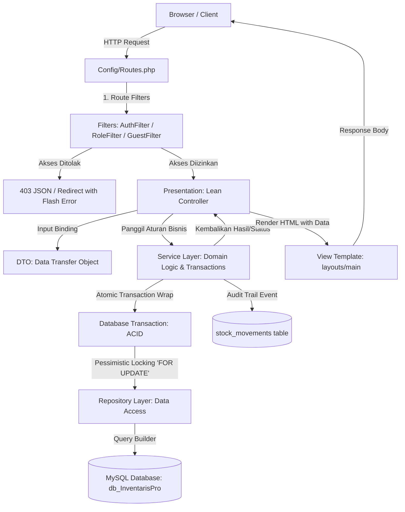

# Arsitektur Sistem & Data Flow: Web Inventory

Dokumen ini menjelaskan rancangan arsitektur berstandar enterprise yang diterapkan pada aplikasi **Web Inventory (CodeIgniter 4 / InventarisPro)**.

---

## 1. Diagram Aliran Data & Otorisasi (Data Flow Architecture)

---

## 2. Definisi Peran Per Lapisan (Layer Responsibilities)

### A. Presentation Layer (`app/Controllers/`)
* **Tanggung Jawab**:
  1. Menerima HTTP request (GET, POST, dll.).
  2. Memeriksa validasi input HTTP dasar.
  3. Mengikat data input ke dalam objek DTO (*Data Transfer Object*).
  4. Memanggil method pada **Service Layer**.
  5. Mengembalikan HTTP Response (redirect dengan flash message atau rendering view).
* **Larangan Keras**:
  * Dilarang menulis kueri SQL atau query builder langsung di controller.
  * Dilarang meletakkan kalkulasi bisnis berat langsung di controller.

### B. Business Logic Layer (`app/Services/`)
* **Tanggung Jawab**:
  1. Menampung seluruh aturan domain bisnis (validasi kuantitas stok cukup, pengecekan keunikan SKU/Username/Email, pencegahan stok minus).
  2. Mengelola batas transaksi atomik melalui `$this->executeInTransaction(callable $operation)`.
  3. Mengatur mutasi stok, audit trail historis, dan proteksi integritas (*anti-self-lockout* pada manajemen akun).
  4. Berdiri independen dari format HTTP (dapat dipanggil oleh Web Controller, REST API, maupun CLI Spark Command).

### C. Data Access Layer (`app/Repositories/`)
* **Tanggung Jawab**:
  1. Melakukan operasi kueri database (SELECT, INSERT, UPDATE, DELETE).
  2. Mengisolasi query builder dan pemanggilan Model dari lapisan atas.
  3. Terikat pada antarmuka *Contract* (`app/Repositories/Contracts/`).
  4. Mendukung *Pessimistic Locking* melalui method `findById(int $id, bool $forUpdate = false)`.

### D. Data Transfer Layer (`app/DTOs/`)
* **Tanggung Jawab**:
  1. Membawa data antar-lapisan dalam bentuk objek bertipe data pasti (*type-safe*).
  2. Mencegah kesalahan ketik kunci array (*array key typo*).

### E. Security & Governance Layer (`app/Filters/` & `app/Helpers/`)
* **Tanggung Jawab**:
  1. **`AuthFilter`**: Memastikan sesi login aktif sebelum mengakses rute terproteksi.
  2. **`RoleFilter`**: Membatasi akses rute administratif (`role:admin`) dari staf operasional.
  3. **`auth_helper.php`**: Fungsi helper global (`has_role()`, `is_admin()`, `is_staff()`) untuk adaptasi antarmuka dinamis.

---

## 3. Rujukan Keputusan Arsitektural Terkait (ADR Links)
* **[ADR-0001: Adopsi Layered Architecture](adr/0001-adopt-layered-architecture.md)**
* **[ADR-0002: Pessimistic Locking untuk Concurrency Stok](adr/0002-pessimistic-locking-for-stock-concurrency.md)**
* **[ADR-0003: RBAC 2-Tingkat & Manajemen Pengguna Terpusat](adr/0003-rbac-and-centralized-user-management.md)**
